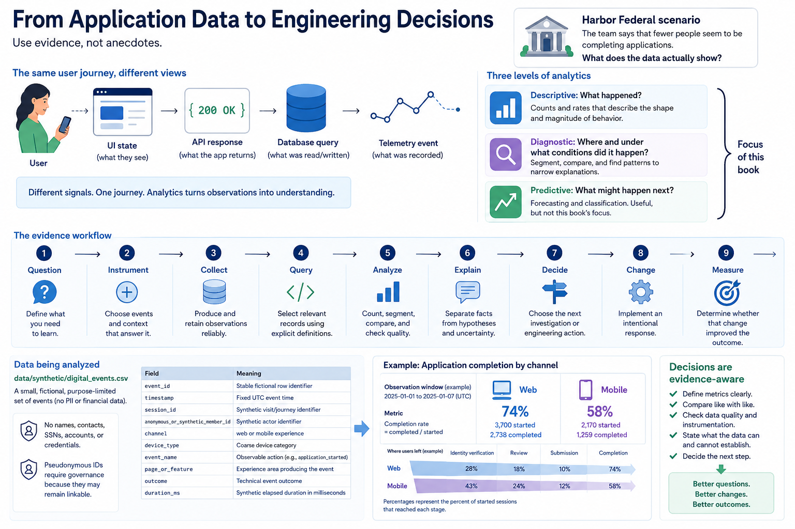

# Chapter 0 — From Application Data to Engineering Decisions



## Why this matters

Full-stack engineers shape both the digital experience and the evidence it leaves behind. A UI state, API response, vendor timeout, database query, and telemetry event are different views of the same journey. Without analytics, teams argue from anecdotes; with careful analytics, engineers can verify scale, locate conditions, form testable hypotheses, and decide what evidence to collect next.

The goal is not to turn an engineer into a data scientist. It is to make ordinary engineering decisions evidence-aware.

## Learning objectives

After this chapter, you can:

- explain why descriptive and diagnostic analytics matter in full-stack work;
- distinguish observation, interpretation, and unsupported claim;
- inspect a purpose-limited event schema;
- calculate session and application counts without a dataframe library;
- compare application completion by channel safely; and
- state what a small dataset cannot establish.

## Harbor Federal scenario

> Harbor's digital account-opening team says that fewer people seem to be completing applications.

Harbor Federal Credit Union is fictional, and “seem” is not yet evidence. The statement immediately opens questions:

- Is completion actually down, and compared with what baseline?
- When did it change?
- Is the decline on web, mobile, or both?
- At what funnel stage are users leaving?
- Is a particular browser or device affected?
- Did an API or vendor integration change?
- Is instrumentation itself broken?
- Do we have enough evidence to conclude anything?

An engineer should translate the concern into precise definitions before changing code. What counts as a start? What counts as completion? Are we counting event rows, distinct sessions, or people? Is the observation window complete?

## Conceptual model

Use this workflow throughout the book:

> **Question → Instrument → Collect → Query → Analyze → Explain → Decide → Change → Measure**

1. **Question:** define what you need to learn.
2. **Instrument:** decide which observable events and context answer it.
3. **Collect:** produce and retain those observations reliably.
4. **Query:** select relevant records using explicit definitions.
5. **Analyze:** count, segment, compare, and check quality.
6. **Explain:** separate facts from hypotheses and uncertainty.
7. **Decide:** choose the next investigation or engineering action.
8. **Change:** implement an intentional response.
9. **Measure:** determine whether that change improved the outcome.

### Three levels of analytics

**Descriptive analytics asks: What happened?** For example, 10,000 application sessions started, 6,800 completed, and the calculated completion rate was 68%. It establishes the shape and magnitude of observed behavior.

**Diagnostic analytics asks: Where and under what conditions did it happen?** It might show that mobile completion was lower than desktop, abandonment concentrated at identity verification, or a change appeared after a particular date. Diagnosis narrows explanations; it does not magically prove causes.

**Predictive analytics asks: What might happen next?** Forecasting and classification often lead toward machine learning. They can be useful, but are not this book's center of gravity.

The progression is **Descriptive → Diagnostic → Predictive**. We concentrate on the first two so that later decisions rest on trustworthy definitions and evidence.

## Data being analyzed

`data/synthetic/digital_events.csv` contains a deliberately small set of fictional events. Each row has:

| Field | Meaning |
| --- | --- |
| `event_id` | Stable fictional row identifier |
| `timestamp` | Fixed UTC event time |
| `session_id` | Synthetic visit/journey identifier |
| `anonymous_or_synthetic_member_id` | Explicitly synthetic actor identifier |
| `channel` | `web` or `mobile` experience |
| `device_type` | Coarse device category |
| `event_name` | Observable action such as `application_started` |
| `page_or_feature` | Experience area producing the event |
| `outcome` | Technical event outcome |
| `duration_ms` | Synthetic elapsed duration in milliseconds |

The events include page views, login and account activity, transfers, application starts, identity-verification starts and completions, submissions, and application completions. A row says that an event was recorded; it does not reveal a person's intent or a root cause.

Only fields necessary for these learning questions are present. There are no names, contact details, SSNs, account numbers, credentials, tokens, or financial facts. Operational data exists to deliver service; analytical data is a purpose-limited representation for answering a question. Even real pseudonymous IDs require governance because they may remain linkable.

## Executable walkthrough

From the repository root, regenerate and inspect the fixture:

```bash
python3 scripts/generate_synthetic_data.py
head -n 6 data/synthetic/digital_events.csv
```

Generation has no randomness and uses a fixed starting timestamp. Re-running it writes the same ordered bytes. Now run:

```bash
python3 scripts/chapter_00_summary.py
```

The source intentionally follows:

```text
events → filter → group/count → calculate → observation
```

`load_events` uses `csv.DictReader`. A set of `session_id` values provides the unique-session count. `count_events` filters with an equality test and sums matches. Channel grouping loops over matching events and increments a dictionary. Finally:

```python
rate = completions / starts * 100 if starts else 0.0
```

The zero-start guard matters: an empty segment should yield `0.0` here rather than crash. In production analysis, you would also label the absence of a denominator rather than imply that a measured population had a true 0% rate.

For this fixture the derivation is:

- all rows: **59 events**;
- the set of all session IDs: **12 unique sessions**;
- session IDs filtered to web/mobile: **7 web** and **5 mobile**;
- `application_started` rows: **10**;
- `application_completed` rows: **7**;
- overall rate: **7 ÷ 10 × 100 = 70.0%**;
- web rate: **5 ÷ 6 × 100 = 83.3%**;
- mobile rate: **2 ÷ 4 × 100 = 50.0%**.

Notice that “sessions” and “application starts” are not interchangeable: two sessions perform other self-service tasks without starting an application.

## Interpretation

Keep three statement types separate:

**Observation:** “Mobile application completion was 50.0% in this synthetic dataset.” This is calculated directly from defined events.

**Interpretation:** “Mobile users may be experiencing more friction.” This is plausible, but it introduces meaning not directly recorded.

**Unsupported claim:** “The mobile application is badly designed.” The fixture cannot establish design quality or causality.

Prefer a reusable evidence vocabulary:

- **observed** and **calculated** for direct results;
- **compared** for an explicit contrast;
- **associated** for patterns that occur together without asserting cause;
- **suggests** and **hypothesis** for explanations to investigate;
- **not established** for boundaries of evidence.

A strong report might say: “We calculated a 50.0% mobile rate and an 83.3% web rate in this small synthetic fixture. Channel is associated with different completion rates here. This suggests a hypothesis about mobile friction; the cause is not established.”

## Common analytical mistakes

1. **Treating event rows as people.** A session can emit many events, and a member can have many sessions.
2. **Using an unstated denominator.** “70% completed” is meaningless until “7 completion events per 10 start events” is explicit.
3. **Confusing absence with abandonment.** Missing completion might reflect delayed completion, instrumentation loss, or the observation window.
4. **Comparing unequal definitions.** Web and mobile instrumentation must use equivalent event semantics.
5. **Claiming causality from segmentation.** A channel difference locates a condition; it does not identify the mechanism.
6. **Ignoring sample size.** Ten starts are excellent for inspection, not broad business generalization.
7. **Collecting everything.** Unnecessary sensitive fields create risk without answering the question.

## Hands-on lab

Record your work in [`labs/chapter_00.md`](../labs/chapter_00.md).

1. Generate or regenerate the fixture.
2. Inspect at least five raw events.
3. Run the summary script.
4. Locate an `application_started` event.
5. Locate an `application_completed` event.
6. Calculate the overall completion rate by hand.
7. Compare basic mobile and web completion rates.
8. Write three observations using precise evidence vocabulary.
9. Write two hypotheses that would require more evidence.
10. Name one conclusion the fixture does **not** justify.

Do the work before reading the next section.

## Expected observations

Use this as a check, not a substitute for calculation:

- Expect 59 event rows across 12 sessions: 7 web and 5 mobile.
- Expect 10 application starts and 7 completions, producing 70.0% overall.
- Expect 6 web starts with 5 completions (83.3%) and 4 mobile starts with 2 completions (50.0%).
- A valid observation states that the fixture's calculated mobile rate is lower than its web rate.
- Possible hypotheses include mobile-specific friction or missing mobile completion instrumentation. Neither is proven.
- The data does not justify claims about real Harbor members, market trends, design quality, or why any journey ended.

## Key takeaways

- Analytics lets full-stack engineers replace anecdotes with defined, reproducible observations.
- Descriptive analytics establishes what happened; diagnostic analytics identifies conditions; predictive work is separate and later.
- Counts require an explicit unit, filter, denominator, and observation window.
- Observation is not interpretation, and association is not causation.
- Purpose-limited synthetic data supports learning without importing operational sensitivity.

## Glossary

- **Analytics:** systematic examination of data to understand and explain behavior.
- **Event:** a recorded observation that an action or state transition occurred.
- **Metric:** a quantitative measurement, such as application starts.
- **Dimension:** a category used to segment a metric, such as channel.
- **Session:** a synthetic grouping of related experience events.
- **Completion rate:** completion count divided by start count under stated definitions.
- **Instrumentation:** code and conventions that create observable signals.
- **Hypothesis:** a testable possible explanation, not a conclusion.

## Review questions

1. Why must “fewer applications are completing” be converted into definitions before action?
2. How do descriptive and diagnostic analytics differ?
3. Why can a mobile/web rate difference not establish its own cause?
4. What does the zero-start guard prevent, and what caveat remains when reporting it?
5. Why should an analytics event omit operational fields unrelated to the question?

## Chapter contract

- **Read:** the chapter and `src/harbor_analytics/dataset.py`.
- **Run:** `python3 scripts/generate_synthetic_data.py && python3 scripts/chapter_00_summary.py` from the repository root.
- **Observe:** Verify the printed analytical unit, counts, window, and evidence boundary rather than reading a percentage alone.
- **Change or investigate:** Complete the exercise below on a filter or copy; committed fixtures remain deterministic.
- **Understand afterward:** Explain what this chapter's evidence establishes, what it only suggests, and which earlier definition it depends on.

## Exercise

1. **Predict:** Before running the lab, write one expected count, segment, pattern, or evidence limitation.
2. **Run:** Execute the contract command and identify the analytical unit behind each reported rate.
3. **Inspect and calculate:** Reproduce one result from its numerator and denominator (or verify one non-rate result from the underlying rows).
4. **Compare and explain:** State one evidence-bounded observation and one interpretation or hypothesis that needs more evidence.
5. **Investigate:** Change a filter, segment, window, fixture copy, or trace target; explain why the result changed.

## Navigation

[Contents](../CONTENTS.md) · [Chapter 1 →](01-the-harbor-federal-analytics-ecosystem.md)
