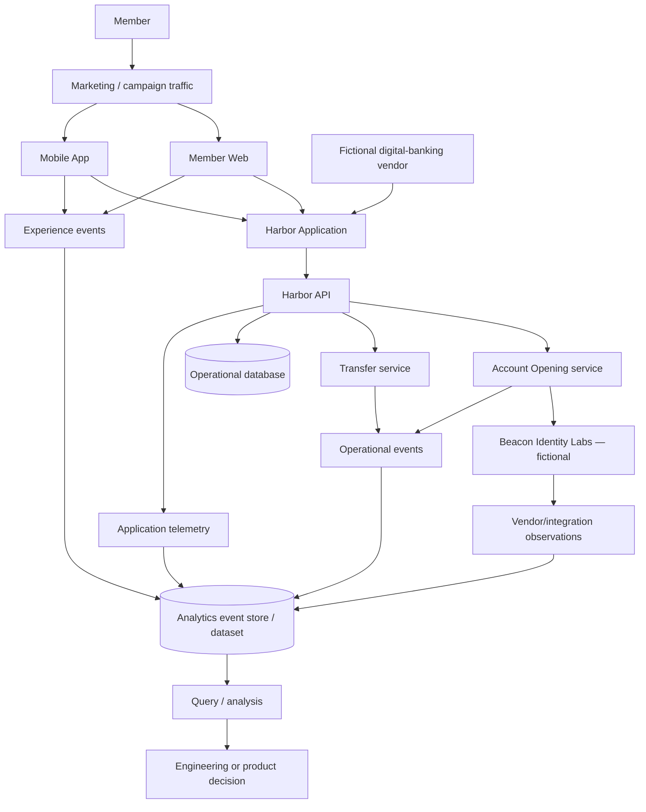

# Chapter 1 — The Harbor Federal Analytics Ecosystem

## Why this matters
A digital journey crosses interfaces, services, stores, and vendors. A count without its origin can be mistaken for evidence it was never designed to provide. Harbor Federal Credit Union is fictional; every record here is synthetic.

## Learning objectives
Identify analytics sources; distinguish operational, telemetry, experience, integration, analytical, and derived data; explain instrumentation; and inspect evidence by source.

## Harbor Federal scenario
A member arrives through fictional campaign traffic at Member Web or the Mobile App. The fictional Harbor digital-banking vendor supplies parts of the experience. Harbor API coordinates Account Opening and Transfer services, an operational database, and **Beacon Identity Labs**, a fictional identity-verification fintech. Each boundary can emit different observations.

## Conceptual explanation


**Operational data** supports transactions and current state. **Application telemetry** describes software health such as latency and errors. **Digital-experience events** record interactions such as page views. **Vendor/integration observations** describe calls and outcomes at a boundary. An **analytical dataset** is a purpose-built, governed representation of selected observations. **Derived metrics** are calculations over it. They must not be collapsed into an undifferentiated dataset: their grains, semantics, retention, sensitivity, and purposes differ.

**Instrumentation** is application code and configuration that records defined events and measurements. **Analytics is only as good as the events and measurements the application actually records.** If a question requires release identity, experiment assignment, or stage visibility that is absent, an engineer must first change instrumentation, validate it, and wait for appropriate observations—not infer the missing evidence.

Use the discipline:
```text
DATA → OBSERVATION → INTERPRETATION → HYPOTHESIS → DECISION
```
A source difference is observed; it is not proof that a source caused an outcome.

## Data used
`digital_events.csv` has one row per recorded event. `source_system` names the emitting layer: `member_web`, `mobile_app`, `harbor_api`, `account_opening`, `identity_provider`, or `transfer_service`. See the data dictionary for every field.

## Executable walkthrough
Run `python3 scripts/generate_synthetic_data.py`, then `python3 scripts/chapter_01_sources.py`. Read each source's event count, unique session count, channels, and contributed event types.

## Interpretation
The account-opening service records lifecycle evidence while the identity provider records verification evidence. Web/mobile page views are experience evidence. Joining their session identifiers enables careful comparison, but shared identifiers do not make meanings interchangeable.

## Common mistakes
Treating logs as complete behavior; counting rows from different grains together; assuming absence means failure; treating `source_system` as a cause; and collecting sensitive fields “just in case.”

## Hands-on lab
Predict which sources contribute `application_completed`, run the source script, compare the result, and propose one new event needed to study a stage that is not recorded. Specify its purpose, fields, and privacy limit.

## Expected observations
Multiple systems represent the same sessions, event types differ by source, and two application sessions record identity failure rather than completion. That pattern suggests investigation only.

## Key takeaways
Trace provenance; preserve source semantics; instrument explicit questions; and move through observation and hypothesis before decision.

## Glossary
**Instrumentation:** recording designed into a system. **Provenance:** where evidence originated. **Telemetry:** software-operation measurements. **Analytical dataset:** selected data shaped for analysis. **Derived metric:** numeric calculation over observations.

## Review questions
1. How does operational data differ from experience events?
2. Why is a source-system field useful?
3. When must instrumentation change before analysis?
4. Why is a joined dataset not automatically causal evidence?
5. What privacy question should precede adding a field?

## Chapter contract

- **Read:** the architecture diagram and `src/harbor_analytics/dataset.py`.
- **Run:** `python3 scripts/chapter_01_sources.py` from the repository root.
- **Observe:** Verify the printed analytical unit, counts, window, and evidence boundary rather than reading a percentage alone.
- **Change or investigate:** Complete the exercise below on a filter or copy; committed fixtures remain deterministic.
- **Understand afterward:** Explain what this chapter's evidence establishes, what it only suggests, and which earlier definition it depends on.

## Exercise

1. **Predict:** Before running the lab, write one expected count, segment, pattern, or evidence limitation.
2. **Run:** Execute the contract command and identify the analytical unit behind each reported rate.
3. **Inspect and calculate:** Reproduce one result from its numerator and denominator (or verify one non-rate result from the underlying rows).
4. **Compare and explain:** State one evidence-bounded observation and one interpretation or hypothesis that needs more evidence.
5. **Investigate:** Change a filter, segment, window, fixture copy, or trace target; explain why the result changed.

## Navigation

[← Chapter 0](00-from-application-data-to-engineering-decisions.md) · [Contents](../CONTENTS.md) · [Chapter 2 →](02-metrics-dimensions-events-and-kpis.md)
