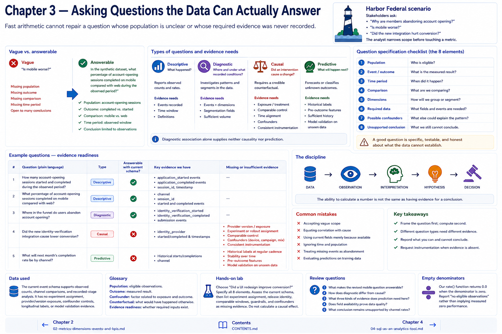

# Chapter 3 — Asking Questions the Data Can Actually Answer



## Why this matters
Fast arithmetic cannot repair a question whose population is unclear or whose required evidence was never recorded.

## Learning objectives
Rewrite vague prompts; classify descriptive, diagnostic, causal, and predictive questions; specify evidence needs; and identify unsupported conclusions.

## Harbor Federal scenario
Stakeholders ask: “Why are members abandoning account opening?”, “Is mobile worse?”, and “Did the new integration hurt conversion?” The analyst narrows scope before touching a metric.

## Conceptual explanation
Vague: **Is mobile worse?** Better: **In the synthetic dataset, what percentage of account-opening sessions completed on mobile compared with web during the observed period?** The better version identifies population, outcome, comparison, and period while limiting the conclusion to observations.

A **descriptive** question asks what happened. A **diagnostic** question investigates where or under what recorded conditions a pattern occurred. A **causal** question asks whether an intervention produced a change and needs a credible counterfactual. A **predictive** question asks about unknown future outcomes and needs historical labels, pre-outcome features, and validation on unseen data. Diagnostic association alone supplies neither causality nor prediction.

For every question specify: (1) population, (2) event/outcome, (3) time period, (4) comparison, (5) dimensions, (6) required data, (7) possible confounders, and (8) the conclusion still unsupported. Channel mix, acquisition campaign, eligibility, device capability, release version, and provider exposure are possible confounders here.

`AnalyticalQuestion` records an educational specification. `assess_evidence` checks fields present on every row and explicit additional evidence requirements. It is a readiness gate, not a query language or proof that data quality is good.

## Data used
The current event schema supports observed counts, channel comparisons, and recorded-stage analysis. It has no experiment assignment, provider/version exposure, confounder controls, longitudinal labels, or model validation evidence.

## Executable walkthrough
Run `python3 scripts/chapter_03_questions.py`. It prints five required questions, their type, readiness, and missing evidence. Read `src/harbor_analytics/questions.py`, then alter a required field in a copy of a question and rerun its assessment.

## Interpretation
“How many started?” and completion by channel are answerable descriptively. Recorded-stage abandonment is classified diagnostic and can locate a recorded transition, though it cannot explain intent. Provider causality and next-month prediction remain unsupported even though the dataset can calculate related grouped counts.

> The ability to calculate a number is not the same as having evidence for a conclusion.

```text
DATA → OBSERVATION → INTERPRETATION → HYPOTHESIS → DECISION
```

## Common mistakes
Accepting vague scope; equating correlation with cause; using current fields merely because available; ignoring time and population; treating missing events as abandonment; and evaluating predictions on training observations.

## Hands-on lab
Choose “Did a UI redesign improve conversion?” Specify all eight elements. Assess the current schema, then list experiment assignment, release identity, comparable windows, guardrails, and confounders as missing evidence. Do not calculate a causal effect.

## Expected observations
Three questions pass the schema/evidence gate; causal and predictive questions fail with explicit evidence gaps. “Answerable” means the fixture can support the limited wording, not that every quality risk disappeared.

## Key takeaways
Frame first, compute second; different question types need different evidence; record unsupported conclusions; request instrumentation when evidence is absent.

## Glossary
**Population:** eligible observations. **Outcome:** measured result. **Confounder:** factor related to exposure and outcome. **Counterfactual:** what would have happened otherwise. **Evidence readiness:** whether required inputs exist.

## Review questions
1. What makes the revised mobile question answerable?
2. How does diagnostic differ from causal?
3. What three kinds of evidence does prediction need here?
4. Does field availability prove data quality?
5. What conclusion remains unsupported by channel rates?

## Chapter contract

- **Read:** the question template and `src/harbor_analytics/questions.py`.
- **Run:** `python3 scripts/chapter_03_questions.py` from the repository root.
- **Observe:** Verify the printed analytical unit, counts, window, and evidence boundary rather than reading a percentage alone.
- **Change or investigate:** Complete the exercise below on a filter or copy; committed fixtures remain deterministic.
- **Understand afterward:** Explain what this chapter's evidence establishes, what it only suggests, and which earlier definition it depends on.

## Exercise

1. **Predict:** Before running the lab, write one expected count, segment, pattern, or evidence limitation.
2. **Run:** Execute the contract command and identify the analytical unit behind each reported rate.
3. **Inspect and calculate:** Reproduce one result from its numerator and denominator (or verify one non-rate result from the underlying rows).
4. **Compare and explain:** State one evidence-bounded observation and one interpretation or hypothesis that needs more evidence.
5. **Investigate:** Change a filter, segment, window, fixture copy, or trace target; explain why the result changed.

## Navigation

[← Chapter 2](02-metrics-dimensions-events-and-kpis.md) · [Contents](../CONTENTS.md) · [Chapter 4 →](04-sql-as-an-analytics-tool.md)
