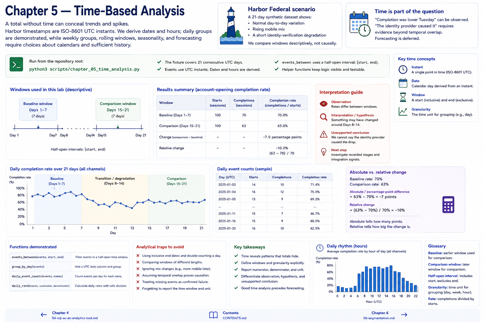

# Chapter 5 — Time-Based Analysis

A total without time can conceal trends and spikes. Harbor timestamps are ISO-8601 UTC instants. We derive dates and hours; daily groups are demonstrated, while weekly groups, rolling windows, seasonality, and forecasting require choices about calendars and sufficient history.

Run `python3 scripts/chapter_05_time_analysis.py`. The 21-day fixture contains normal variation, rising mobile mix, and a short identity-verification degradation. A baseline and comparison are descriptive windows, not automatically an experiment. `events_between` uses a half-open interval; `group_by_day`, `daily_event_counts`, and `daily_rate` keep logic visible.

For 70% → 63%, the absolute/percentage-point difference is -7 points, while relative change is `(63-70)/70 = -10%`. “Completion was lower Tuesday” can be observed. “The identity provider caused it” requires evidence beyond temporal overlap. Forecasting is deferred.

## Chapter contract

- **Read:** the window definitions and `src/harbor_analytics/time_analysis.py`.
- **Run:** `python3 scripts/chapter_05_time_analysis.py` from the repository root.
- **Observe:** Verify the printed analytical unit, counts, window, and evidence boundary rather than reading a percentage alone.
- **Change or investigate:** Complete the exercise below on a filter or copy; committed fixtures remain deterministic.
- **Understand afterward:** Explain what this chapter's evidence establishes, what it only suggests, and which earlier definition it depends on.

## Exercise

1. **Predict:** Before running the lab, write one expected count, segment, pattern, or evidence limitation.
2. **Run:** Execute the contract command and identify the analytical unit behind each reported rate.
3. **Inspect and calculate:** Reproduce one result from its numerator and denominator (or verify one non-rate result from the underlying rows).
4. **Compare and explain:** State one evidence-bounded observation and one interpretation or hypothesis that needs more evidence.
5. **Investigate:** Change a filter, segment, window, fixture copy, or trace target; explain why the result changed.

## Navigation

[← Chapter 4](04-sql-as-an-analytics-tool.md) · [Contents](../CONTENTS.md) · [Chapter 6 →](06-segmentation.md)
