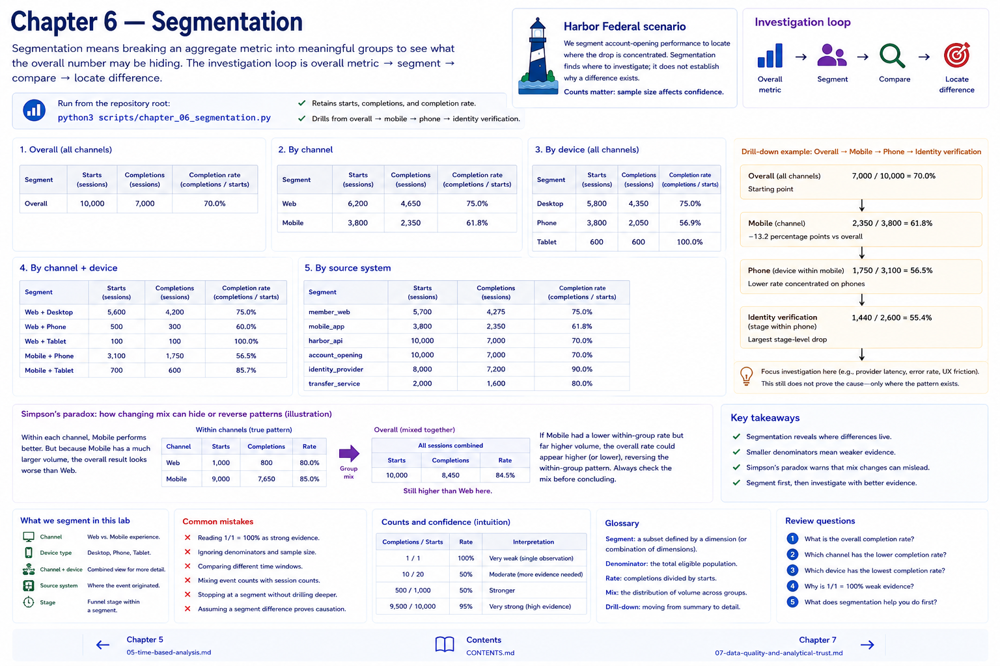

# Chapter 6 — Segmentation

Segmentation means **breaking an aggregate metric into meaningful groups to see what the overall number may be hiding.** The investigation loop is overall metric → segment → compare → locate difference.

Run `python3 scripts/chapter_06_segmentation.py` to retain starts, completions, and rates by channel, device, channel + device, and source system, then drill from overall → mobile → phone → identity verification. Counts matter: 1/1 = 100% is weaker evidence than 9,500/10,000 = 95%.

Simpson's paradox is the compact warning that a changing group mix can hide or reverse within-group patterns. It is not forced into Harbor's main fixture. Segmentation locates where to investigate; it does not establish why a difference exists.

## Chapter contract

- **Read:** the segment definitions and `src/harbor_analytics/segmentation.py`.
- **Run:** `python3 scripts/chapter_06_segmentation.py` from the repository root.
- **Observe:** Verify the printed analytical unit, counts, window, and evidence boundary rather than reading a percentage alone.
- **Change or investigate:** Complete the exercise below on a filter or copy; committed fixtures remain deterministic.
- **Understand afterward:** Explain what this chapter's evidence establishes, what it only suggests, and which earlier definition it depends on.

## Exercise

1. **Predict:** Before running the lab, write one expected count, segment, pattern, or evidence limitation.
2. **Run:** Execute the contract command and identify the analytical unit behind each reported rate.
3. **Inspect and calculate:** Reproduce one result from its numerator and denominator (or verify one non-rate result from the underlying rows).
4. **Compare and explain:** State one evidence-bounded observation and one interpretation or hypothesis that needs more evidence.
5. **Investigate:** Change a filter, segment, window, fixture copy, or trace target; explain why the result changed.

## Navigation

[← Chapter 5](05-time-based-analysis.md) · [Contents](../CONTENTS.md) · [Chapter 7 →](07-data-quality-and-analytical-trust.md)
