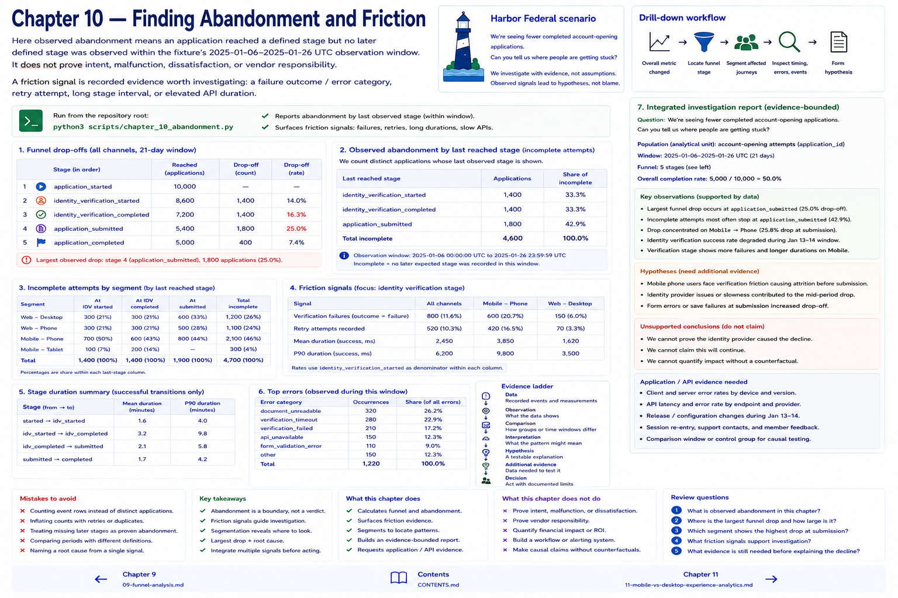

# 10. Finding Abandonment and Friction



Here **observed abandonment** means an application reached a defined stage but no later defined stage was observed within the fixture's 2025-01-06–2025-01-26 UTC observation window. It does not prove intent, malfunction, dissatisfaction, or vendor responsibility.

A friction signal is recorded evidence worth investigating: a failure outcome/error category, retry attempt, long stage interval, or elevated API duration. Observed abandonment plus a friction signal is an investigation lead—not a proven cause. `last_reached_stage`, `abandonment_by_stage`, `incomplete_by_segment`, `stage_duration`, and `journey_duration` make that distinction inspectable.

## Drill-down workflow

```text
Overall metric changed → locate funnel stage → segment affected journeys
→ inspect timing/errors/events → form hypothesis → seek corroborating evidence
```

For example, a drop near verification concentrated on mobile alongside longer durations can motivate inspection of mobile, API, and vendor telemetry. It cannot establish which component caused the pattern.

## Integrated investigation

Run `python3 scripts/chapter_10_abandonment.py` to answer Harbor's fictional request: “We're seeing fewer completed account-opening applications. Can you tell us where people are getting stuck?” The generated report states its question, population, funnel, largest observed drop, segmentation, friction evidence, supported observations, hypotheses, and unsupported conclusions.

Use the evidence ladder: **data → observation → comparison → interpretation → hypothesis → additional evidence → decision**. Review verification outcomes, durations, errors, and retries; then list application/API evidence needed to test each hypothesis. Chapters 11–13 are intentionally deferred.

## Chapter contract

- **Read:** the abandonment definition and `src/harbor_analytics/experience.py`.
- **Run:** `python3 scripts/chapter_10_abandonment.py` from the repository root.
- **Observe:** Verify the printed analytical unit, counts, window, and evidence boundary rather than reading a percentage alone.
- **Change or investigate:** Complete the exercise below on a filter or copy; committed fixtures remain deterministic.
- **Understand afterward:** Explain what this chapter's evidence establishes, what it only suggests, and which earlier definition it depends on.

## Exercise

1. **Predict:** Before running the lab, write one expected count, segment, pattern, or evidence limitation.
2. **Run:** Execute the contract command and identify the analytical unit behind each reported rate.
3. **Inspect and calculate:** Reproduce one result from its numerator and denominator (or verify one non-rate result from the underlying rows).
4. **Compare and explain:** State one evidence-bounded observation and one interpretation or hypothesis that needs more evidence.
5. **Investigate:** Change a filter, segment, window, fixture copy, or trace target; explain why the result changed.

## Navigation

[← Chapter 9](09-funnel-analysis.md) · [Contents](../CONTENTS.md) · [Chapter 11 →](11-mobile-vs-desktop-experience-analytics.md)
