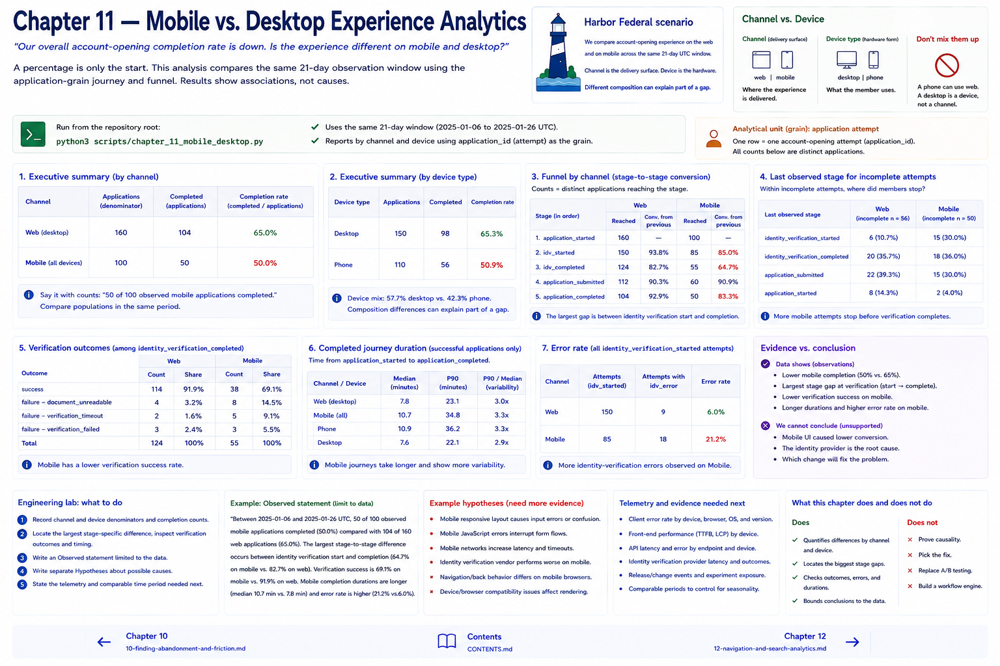

# 11 — Mobile vs. Desktop Experience Analytics

> “Our overall account-opening completion rate is down. Is the experience different on mobile and desktop?”

A percentage is only the start. Run `python3 scripts/chapter_11_mobile_desktop.py` to compare the same 21-day UTC observation window. The script reuses the application-grain journey and funnel: it reports applications, completions, stage-to-stage counts, last observed stage, and completed-journey duration.

## Channel is not device

`channel` identifies the delivery surface (`web` or `mobile` in this fixture). `device_type` identifies hardware form (`desktop` or `phone`). A phone can use web; a desktop is a device, not a channel. Never substitute one dimension for the other.

“Mobile completion is 50%” hides its reliability. Say “50 of 100 observed mobile applications completed.” Compare populations in the same stated period. Inspect device mix, errors, identity outcomes, latency, and duration. Different composition can explain part of an aggregate difference.

The reusable `completion_by_dimension`, `funnel_by_dimension`, `abandonment_by_dimension`, and `duration_by_dimension` functions deliberately support only relevant dimensions. Funnel counts reveal whether a gap concentrates between identity start and completion or after submission.

## Engineering lab

1. Record channel and device denominators and completion counts.
2. Locate the largest stage-specific difference; inspect verification failure outcomes and timing.
3. Write an **Observed** statement limited to the data.
4. Write separate **Hypotheses** about responsive layout, form usability, JavaScript errors, network latency, API behavior, identity verification, navigation, browser/device compatibility.
5. State the telemetry and comparable time period needed next.

Lower mobile completion establishes an association, not “the mobile UI caused lower conversion.”

## Chapter contract

- **Read:** the channel/device distinction and `src/harbor_analytics/experience.py`.
- **Run:** `python3 scripts/chapter_11_mobile_desktop.py` from the repository root.
- **Observe:** Verify the printed analytical unit, counts, window, and evidence boundary rather than reading a percentage alone.
- **Change or investigate:** Complete the exercise below on a filter or copy; committed fixtures remain deterministic.
- **Understand afterward:** Explain what this chapter's evidence establishes, what it only suggests, and which earlier definition it depends on.

## Exercise

1. **Predict:** Before running the lab, write one expected count, segment, pattern, or evidence limitation.
2. **Run:** Execute the contract command and identify the analytical unit behind each reported rate.
3. **Inspect and calculate:** Reproduce one result from its numerator and denominator (or verify one non-rate result from the underlying rows).
4. **Compare and explain:** State one evidence-bounded observation and one interpretation or hypothesis that needs more evidence.
5. **Investigate:** Change a filter, segment, window, fixture copy, or trace target; explain why the result changed.

## Navigation

[← Chapter 10](10-finding-abandonment-and-friction.md) · [Contents](../CONTENTS.md) · [Chapter 12 →](12-navigation-and-search-analytics.md)
