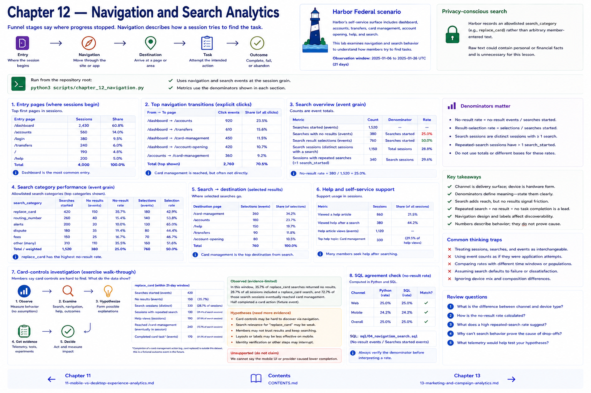

# 12 — Navigation and Search Analytics



Funnel stages say where progress stopped. Navigation describes how a session tries to find the task:

```text
Entry → Navigation → Destination → Task → Outcome
```

Harbor's fictional self-service surface contains dashboard, accounts, transfers, card management, account opening, help, and search. `page_view`, `navigation_click`, `search_started`, `search_results_viewed`, `search_result_selected`, `search_no_results`, and `help_article_viewed` remain event-grain observations. The utilities summarize entry pages, explicit transitions, normalized search categories, repeated searches, and help use—not a graph engine.

## Privacy-conscious search

Harbor records an allowlisted `search_category`, such as `replace_card`, rather than arbitrary member-entered text. Raw text could contain personal or financial facts and is unnecessary for this lesson.

Run `python3 scripts/chapter_12_navigation.py`. Its denominators matter:

* no-result rate = searches with `search_no_results` / `search_started` events;
* result-selection rate = selections / searches performed;
* search sessions are distinct sessions with a search and are not interchangeable with searches;
* repeated-search sessions contain more than one `search_started` event.

Search is not inherently bad: a member may prefer it. Repeated search + no result + no measured task completion is a friction signal, not a cause.

## Card-controls exercise

Investigate the claim “members say card controls are hard to find.” Examine dashboard transitions, `replace_card` searches, repeats, no results, help, and eventual card-management views. Contrast:

**Observed:** A measured share of sessions seeking card replacement used search before reaching the task.

**Hypothesis:** Card-management navigation may be difficult to discover.

Run `sql/04_navigation_search.sql`; compare its no-result rate to Python. Explain the event denominator before interpreting it.

## Chapter contract

- **Read:** the privacy note, `src/harbor_analytics/navigation.py`, and `sql/04_navigation_search.sql`.
- **Run:** `python3 scripts/chapter_12_navigation.py` from the repository root.
- **Observe:** Verify the printed analytical unit, counts, window, and evidence boundary rather than reading a percentage alone.
- **Change or investigate:** Complete the exercise below on a filter or copy; committed fixtures remain deterministic.
- **Understand afterward:** Explain what this chapter's evidence establishes, what it only suggests, and which earlier definition it depends on.

## Exercise

1. **Predict:** Before running the lab, write one expected count, segment, pattern, or evidence limitation.
2. **Run:** Execute the contract command and identify the analytical unit behind each reported rate.
3. **Inspect and calculate:** Reproduce one result from its numerator and denominator (or verify one non-rate result from the underlying rows).
4. **Compare and explain:** State one evidence-bounded observation and one interpretation or hypothesis that needs more evidence.
5. **Investigate:** Change a filter, segment, window, fixture copy, or trace target; explain why the result changed.

## Navigation

[← Chapter 11](11-mobile-vs-desktop-experience-analytics.md) · [Contents](../CONTENTS.md) · [Chapter 13 →](13-marketing-and-campaign-analytics.md)
