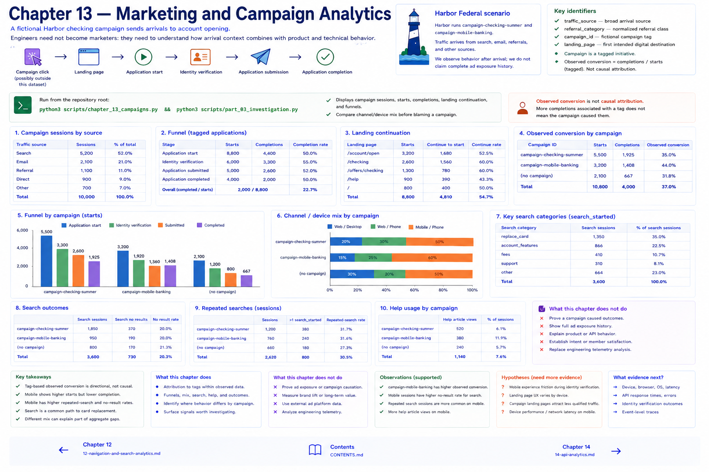

# 13 — Marketing and Campaign Analytics



A fictional Harbor checking campaign sends arrivals to account opening. Engineers need not become marketers: they need to understand how arrival context combines with product and technical behavior.

```text
Campaign click (possibly outside this dataset)
→ landing page → application start → identity verification → submission → completion
```

`traffic_source` is the broad arrival source. `referral_category` is a normalized referral class. `campaign_id` is a fictional tag, and `landing_page` is the first intended digital destination. A campaign is a tagged initiative; **observed conversion** is completed tagged applications divided by tagged starts. It is not causal attribution. Harbor observes behavior after arrival but does not claim complete advertisement exposure history.

Run `python3 scripts/chapter_13_campaigns.py`. It displays campaign sessions, starts, completions, explicit observed completion denominators, landing continuation, and funnels. `campaign-checking-summer` and `campaign-mobile-banking` are synthetic. Compare channel/device mix before blaming a campaign: an aggregate gap may shrink within comparable devices. More completions associated with a tag do not mean the campaign caused them.

## The engineering boundary

A “marketing problem” can instead appear as arrival → landing load → start → slower mobile identity verification → lower completion. That pattern motivates checking campaign, device/channel, stage, and then API/integration evidence. It still does not prove cause.

Complete `python3 scripts/part_03_investigation.py`. Its ten-section report moves from overall funnel through segmentation, navigation/search, campaign context, confounders, technical leads, supported conclusions, hypotheses, and unsupported claims.

## Prepare for Part IV

Part III can establish that mobile users abandon more frequently at identity verification. The next question is: **What was the application/API/vendor actually doing during those sessions?**

```text
Digital experience → Harbor API → vendor integration → database → errors / latency / outcomes
```

Chapters 14–17 will examine that engineering telemetry. This chapter intentionally does not answer it.

## Chapter contract

- **Read:** the attribution boundary, `src/harbor_analytics/campaigns.py`, and `sql/05_campaign_funnel.sql`.
- **Run:** `python3 scripts/chapter_13_campaigns.py && python3 scripts/part_03_investigation.py` from the repository root.
- **Observe:** Verify the printed analytical unit, counts, window, and evidence boundary rather than reading a percentage alone.
- **Change or investigate:** Complete the exercise below on a filter or copy; committed fixtures remain deterministic.
- **Understand afterward:** Explain what this chapter's evidence establishes, what it only suggests, and which earlier definition it depends on.

## Exercise

1. **Predict:** Before running the lab, write one expected count, segment, pattern, or evidence limitation.
2. **Run:** Execute the contract command and identify the analytical unit behind each reported rate.
3. **Inspect and calculate:** Reproduce one result from its numerator and denominator (or verify one non-rate result from the underlying rows).
4. **Compare and explain:** State one evidence-bounded observation and one interpretation or hypothesis that needs more evidence.
5. **Investigate:** Change a filter, segment, window, fixture copy, or trace target; explain why the result changed.

## Navigation

[← Chapter 12](12-navigation-and-search-analytics.md) · [Contents](../CONTENTS.md) · [Chapter 14 →](14-api-analytics.md)
