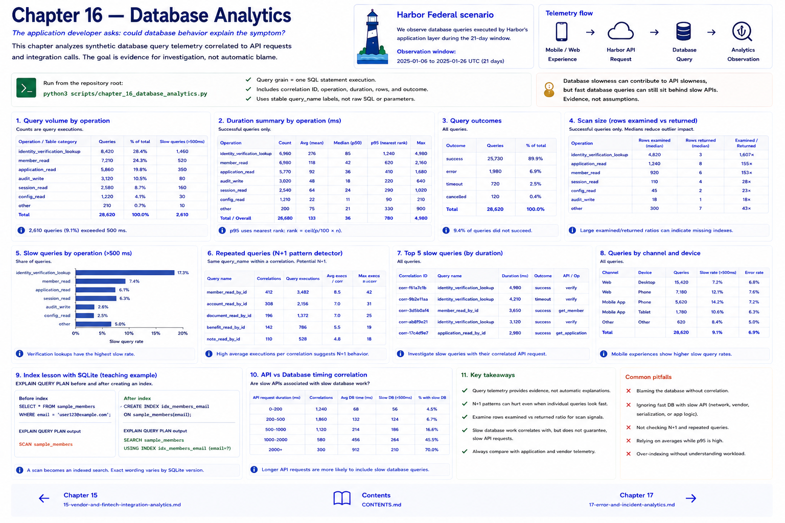

# Chapter 16 — Database Analytics

The application developer asks: **could database behavior explain the symptom?** Query observations use stable labels—not raw SQL parameters—and include correlation ID, operation/table category, duration, rows examined/returned, and outcome. Analyze volume, average/p95, slow counts, errors, scan size, and repetition.

N+1 is visible analytically when one request triggers a parent query and many repeated child queries. Each child can look moderate while their combined request cost is material. `repeated_queries` groups `(correlation_id, query_name)` to expose that pattern. The fixture also deliberately includes both a slow API request with a slow correlated lookup and slow requests whose database work is fast. SQL should not become the default explanation.

For an index lesson, use SQLite `EXPLAIN QUERY PLAN` on a teaching table before and after `CREATE INDEX`: expect a scan to become an indexed search (wording can vary by SQLite version). This teaches plan observation only; SQLite on a laptop is not equivalent to Harbor's fictional production banking infrastructure or production MySQL. Run `python3 scripts/chapter_16_database_analytics.py`.

## Chapter contract

- **Read:** the query-grain discussion and `src/harbor_analytics/database.py`.
- **Run:** `python3 scripts/chapter_16_database_analytics.py` from the repository root.
- **Observe:** Verify the printed analytical unit, counts, window, and evidence boundary rather than reading a percentage alone.
- **Change or investigate:** Complete the exercise below on a filter or copy; committed fixtures remain deterministic.
- **Understand afterward:** Explain what this chapter's evidence establishes, what it only suggests, and which earlier definition it depends on.

## Exercise

1. **Predict:** Before running the lab, write one expected count, segment, pattern, or evidence limitation.
2. **Run:** Execute the contract command and identify the analytical unit behind each reported rate.
3. **Inspect and calculate:** Reproduce one result from its numerator and denominator (or verify one non-rate result from the underlying rows).
4. **Compare and explain:** State one evidence-bounded observation and one interpretation or hypothesis that needs more evidence.
5. **Investigate:** Change a filter, segment, window, fixture copy, or trace target; explain why the result changed.

## Navigation

[← Chapter 15](15-vendor-and-fintech-integration-analytics.md) · [Contents](../CONTENTS.md) · [Chapter 17 →](17-error-and-incident-analytics.md)
