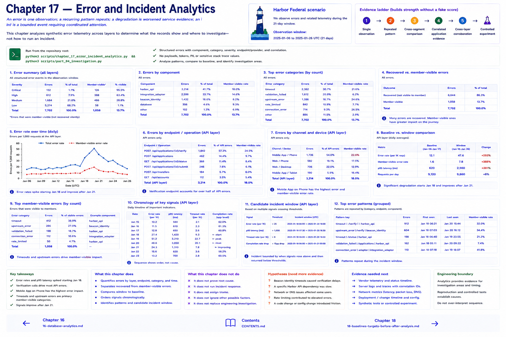

# Chapter 17 — Error and Incident Analytics

An **error** is one observation; a **recurring pattern** repeats; a **degradation** is worsened service evidence; an **incident** is a bounded event requiring coordinated attention. This analytics chapter asks what records show and where to investigate—not how to run incident response.

Structured errors record component/category/severity, endpoint/provider, correlation, recoverability, and member visibility. They exclude payloads and sensitive stack values. Group over time, component, endpoint, and category; distinguish recovered from member-visible errors and compare a pattern with its historical baseline before calling it new.

The deterministic baseline/incident comparison covers completion context, API error and p95, provider timeout, database latency, and visible errors. A chronological view orders starts, latency, timeouts, retries, completion changes, and abandonment observations. **Sequence establishes order, not cause.** Run `python3 scripts/chapter_17_error_incident_analytics.py` and `python3 scripts/part_04_investigation.py`.

Evidence strengthens without a fake score: `single observation → repeated pattern → cross-segment comparison → correlated application evidence → cross-layer corroboration → controlled experiment`. Corroboration supports an engineering hypothesis; reproduction or a controlled experiment may still be needed.

## Chapter contract

- **Read:** the incident definitions and `src/harbor_analytics/engineering.py`.
- **Run:** `python3 scripts/chapter_17_error_incident_analytics.py && python3 scripts/part_04_investigation.py` from the repository root.
- **Observe:** Verify the printed analytical unit, counts, window, and evidence boundary rather than reading a percentage alone.
- **Change or investigate:** Complete the exercise below on a filter or copy; committed fixtures remain deterministic.
- **Understand afterward:** Explain what this chapter's evidence establishes, what it only suggests, and which earlier definition it depends on.

## Exercise

1. **Predict:** Before running the lab, write one expected count, segment, pattern, or evidence limitation.
2. **Run:** Execute the contract command and identify the analytical unit behind each reported rate.
3. **Inspect and calculate:** Reproduce one result from its numerator and denominator (or verify one non-rate result from the underlying rows).
4. **Compare and explain:** State one evidence-bounded observation and one interpretation or hypothesis that needs more evidence.
5. **Investigate:** Change a filter, segment, window, fixture copy, or trace target; explain why the result changed.

## Navigation

[← Chapter 16](16-database-analytics.md) · [Contents](../CONTENTS.md) · [Chapter 18 →](18-baselines-targets-and-before-after-analysis.md)
