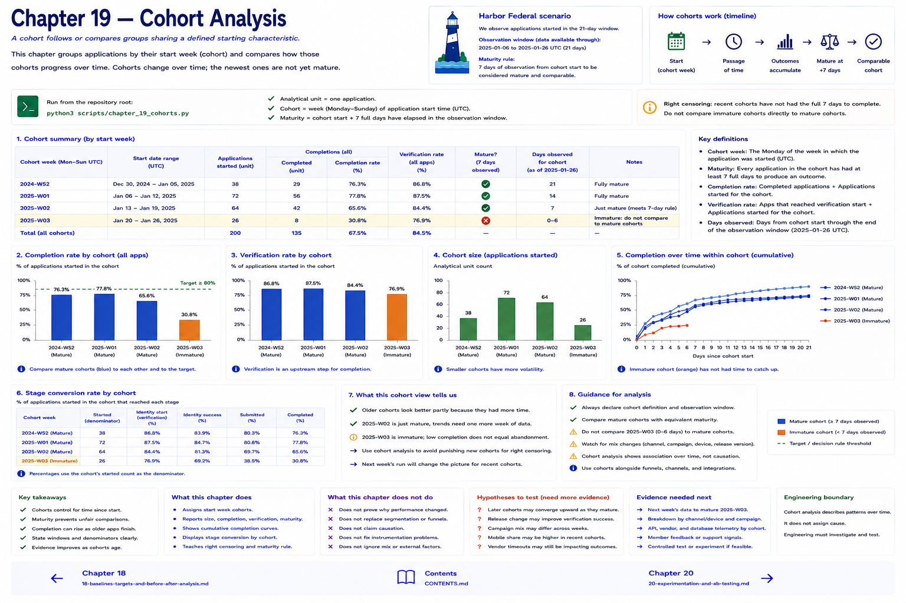

# Chapter 19 — Cohort Analysis



A **cohort** follows or compares groups sharing a defined starting characteristic. Segmentation compares mobile with desktop; cohort analysis compares applications started in Week 1 with those started in Week 2. Other useful software cohorts include first digital-use month, experience version, and campaign-entry period.

The analytical unit here is one application. `assign_start_cohort` assigns its UTC start to a Monday week, while `cohort_counts`, `cohort_completion`, and `cohort_stage_conversion` keep readable arithmetic. These are focused helpers, not an OLAP system.

## Time changes the denominator
An overall rate can rise because older applications finish later, even while the newest start cohort performs worse. Every comparison therefore needs both a start definition and an observation horizon. **Right censoring** means a recent application has not yet had the full chance to produce an outcome. “Not completed yet” is not automatically “abandoned.” Harbor's lab declares seven days of maturity and marks a cohort safe only when every application has received that window.

```bash
python3 scripts/chapter_19_cohorts.py
```

Read size, completion count and rate, verification rate, and maturity together. Compare mature cohorts with equivalent windows; describe an immature cohort rather than ranking it against mature cohorts. This refines Chapter 10's fixed-window abandonment rule rather than replacing it.

## Chapter contract

- **Read:** the maturity rule and `src/harbor_analytics/decisions.py`.
- **Run:** `python3 scripts/chapter_19_cohorts.py` from the repository root.
- **Observe:** Verify the printed analytical unit, counts, window, and evidence boundary rather than reading a percentage alone.
- **Change or investigate:** Complete the exercise below on a filter or copy; committed fixtures remain deterministic.
- **Understand afterward:** Explain what this chapter's evidence establishes, what it only suggests, and which earlier definition it depends on.

## Exercise

1. **Predict:** Before running the lab, write one expected count, segment, pattern, or evidence limitation.
2. **Run:** Execute the contract command and identify the analytical unit behind each reported rate.
3. **Inspect and calculate:** Reproduce one result from its numerator and denominator (or verify one non-rate result from the underlying rows).
4. **Compare and explain:** State one evidence-bounded observation and one interpretation or hypothesis that needs more evidence.
5. **Investigate:** Change a filter, segment, window, fixture copy, or trace target; explain why the result changed.

## Navigation

[← Chapter 18](18-baselines-targets-and-before-after-analysis.md) · [Contents](../CONTENTS.md) · [Chapter 20 →](20-experimentation-and-ab-testing.md)
