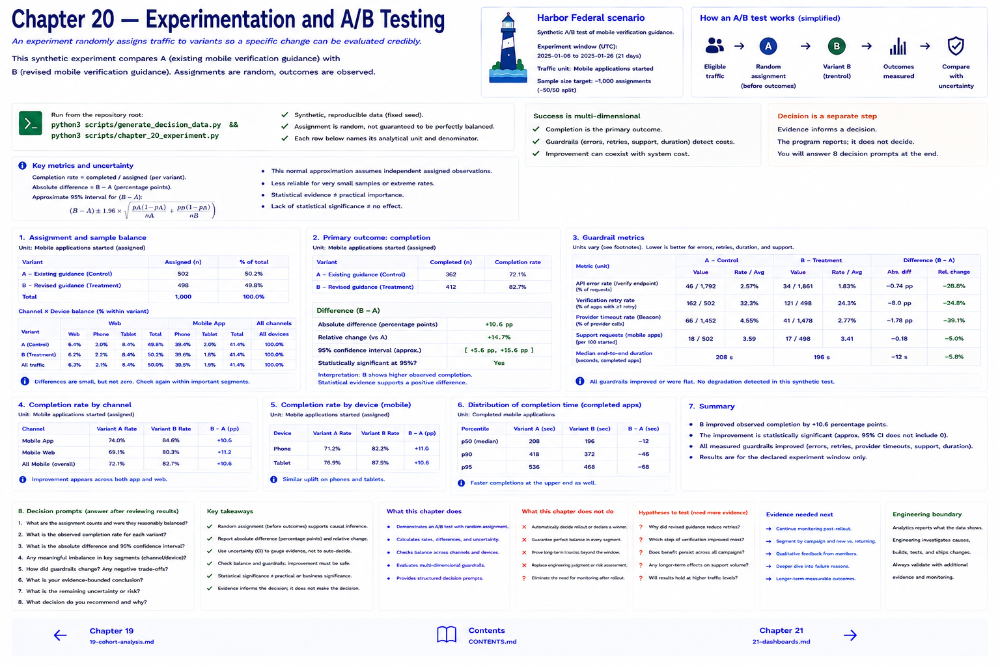

# Chapter 20 — Experimentation and A/B Testing



An experiment deliberately assigns comparable traffic to controlled variants so a specific change can be evaluated more credibly than a before/after observation. Harbor's entirely synthetic experiment compares A, existing guidance, with B, revised mobile verification guidance.

`generate_experiment` uses a fixed seed. It draws assignments before outcomes, then models a declared synthetic treatment probability. Reproducibility is not predictability, and random assignment **does not guarantee perfect balance in every small sample**. Inspect sample counts and channel/device balance before interpreting.

## Metrics and uncertainty
For each variant calculate `completed / assigned`, then B−A as an absolute rate difference, percentage points, and relative change. The helper's approximate 95% interval is

```text
(B - A) ± 1.96 × sqrt(pA(1-pA)/nA + pB(1-pB)/nB)
```

This standard-library normal approximation assumes independent assigned observations and is less reliable for tiny samples or extreme rates. It is an uncertainty aid, not a rollout oracle. Statistical significance is not practical importance; lack of significance does not prove no effect. Keep **statistical evidence**, **engineering significance**, and **business significance** distinct.

Completion is not enough. API errors, verification retries, support requests, and duration are guardrails: an improvement can coexist with a system cost.

```bash
python3 scripts/generate_decision_data.py
python3 scripts/chapter_20_experiment.py
```

Answer the eight prompts: assignment counts; completion; difference; imbalance; guardrail changes; supported conclusion; uncertainty; and rollout, more data, revision, or rollback. The program deliberately does not decide.

## Chapter contract

- **Read:** the assignment/uncertainty discussion and `src/harbor_analytics/decisions.py`.
- **Run:** `python3 scripts/generate_decision_data.py && python3 scripts/chapter_20_experiment.py` from the repository root.
- **Observe:** Verify the printed analytical unit, counts, window, and evidence boundary rather than reading a percentage alone.
- **Change or investigate:** Complete the exercise below on a filter or copy; committed fixtures remain deterministic.
- **Understand afterward:** Explain what this chapter's evidence establishes, what it only suggests, and which earlier definition it depends on.

## Exercise

1. **Predict:** Before running the lab, write one expected count, segment, pattern, or evidence limitation.
2. **Run:** Execute the contract command and identify the analytical unit behind each reported rate.
3. **Inspect and calculate:** Reproduce one result from its numerator and denominator (or verify one non-rate result from the underlying rows).
4. **Compare and explain:** State one evidence-bounded observation and one interpretation or hypothesis that needs more evidence.
5. **Investigate:** Change a filter, segment, window, fixture copy, or trace target; explain why the result changed.

## Navigation

[← Chapter 19](19-cohort-analysis.md) · [Contents](../CONTENTS.md) · [Chapter 21 →](21-dashboards-for-engineers-product-and-operations.md)
