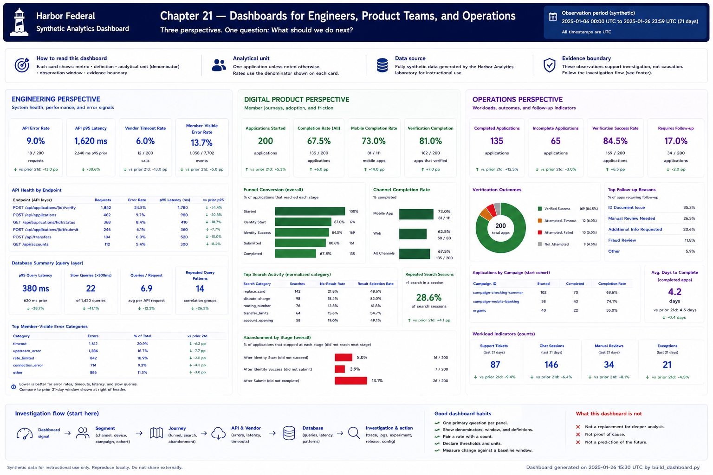

# Chapter 21 — Dashboards for Engineers, Product Teams, and Operations



Dashboards are not chart collections. Begin with **Audience → Question → Metric → Context → Decision**. These three Harbor perspectives are examples, not exhaustive departmental scorecards.

* **Engineering:** API error rate, p95 latency, vendor timeouts, query behavior, and member-visible errors.
* **Digital Product:** starts, funnel completion and abandonment, channel differences, and search/navigation friction.
* **Operations:** completed/incomplete applications, verification outcomes, exceptions, and follow-up indicators.

```bash
python3 scripts/build_dashboard.py
# open dist/dashboard.html locally
```

The generator emits semantic, offline HTML with no CDN or JavaScript dependency. Cards and tables state the synthetic observation period, definitions, and denominators.

## Traps and repairs
“Visits increased” is vanity without a decision; show qualified starts and the question. “5% errors” lacks a denominator/window; show errors/requests and dates. Mean latency hides tails; pair it with p95. A wall of metrics hides priorities; select audience questions. Red/green without thresholds conceals judgment; declare thresholds. Mixing operational health with business results implies a relationship; separate the panels. Correlated completion and timeouts are not an explanation; label the association and investigate.

```text
Dashboard signal → Segment → Journey → API/vendor/database evidence → Investigation
```

A dashboard starts an investigation. It cannot replace request traces, cohort checks, experiments, or reasoning.

## Chapter contract

- **Read:** the audience questions and `src/harbor_analytics/decisions.py`.
- **Run:** `python3 scripts/build_dashboard.py` from the repository root.
- **Observe:** Verify the printed analytical unit, counts, window, and evidence boundary rather than reading a percentage alone.
- **Change or investigate:** Complete the exercise below on a filter or copy; committed fixtures remain deterministic.
- **Understand afterward:** Explain what this chapter's evidence establishes, what it only suggests, and which earlier definition it depends on.

## Exercise

1. Predict which metrics each audience needs before building.
2. Run the generator and open `dist/dashboard.html`.
3. Inspect the HTML source for network URLs and verify each rate's denominator/context.
4. Compare the engineering, product, and operations panels: explain one different decision each supports.
5. Change one display label to make its analytical unit clearer, rebuild, and inspect the result; revert the practice edit afterward.

## Navigation

[← Chapter 20](20-experimentation-and-ab-testing.md) · [Contents](../CONTENTS.md) · [Chapter 22 →](22-communicating-findings-without-overclaiming.md)
