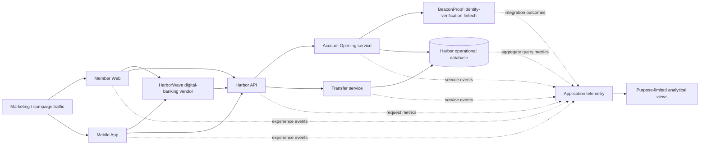

# Harbor Federal Analytics Architecture

Harbor Federal Credit Union and every provider below are fictional. This conceptual architecture distinguishes operational systems from analytical observations. It does **not** imply that all records are copied into one database.

## Layers and evidence

- **Experience:** Member Web and Mobile App emit navigation, search, funnel, channel, device, and campaign-attribution observations.
- **Delivery and integration:** Harbor API, Account Opening, Transfer, fictional HarborWave, and fictional BeaconProof expose latency, outcome, and correlation signals.
- **Operations:** the Harbor operational database is the system of record for service workflows. Analysts should use approved, minimized views—not assume raw operational records are analytics events.
- **Telemetry and analysis:** application telemetry can relate observations through synthetic session or correlation identifiers. The analytical view may query or combine governed extracts while sources retain separate ownership, semantics, and retention.

An experience event can show that a member journey stopped; an API metric can show an error at the same time; an integration outcome can add context. Their association supports a hypothesis, but correlation alone does not establish causation. Instrumentation gaps and mismatched clocks or identifiers must also be considered.

## Data boundaries

The Chapter 0 fixture models only experience events. Future chapters may add separate API, integration, database, and telemetry datasets rather than widening one universal table. This preserves source semantics and teaches explicit joins. Refer to [privacy guidance](PRIVACY.md) before adding fields.

