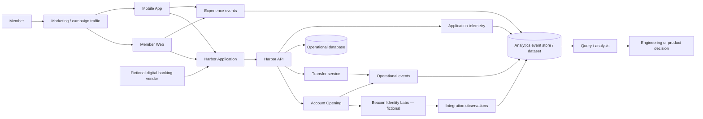

# Harbor Federal analytical architecture

Harbor Federal Credit Union and every vendor named here are fictional. Member Web and Mobile App feed the Harbor Application. Harbor API coordinates Account Opening, Transfer, the operational database, and fictional identity provider Beacon Identity Labs; experience components may be supplied by a fictional digital-banking vendor. Marketing/campaign traffic supplies acquisition context.



Operational records deliver service; telemetry describes software behavior; experience events describe interaction; integration observations describe system boundaries. The analytical store selects and harmonizes only purpose-appropriate fields. Derived metrics are calculations, not raw facts. Preserve provenance and grain instead of collapsing these meanings.

Instrumentation must precede questions requiring unrecorded release, experiment, stage, or exposure evidence. Collection should be purpose-limited. See [the data dictionary](DATA_DICTIONARY.md) and [privacy guidance](PRIVACY.md).

## Part II local analytical flow

```text
deterministic generator → committed clean CSV → disposable SQLite database
                         ↘ separate deterministic dirty teaching fixture
```

The CSV/generator is authoritative. `build_analytics_db.py` recreates a local SQLite projection; the database is ignored by Git. Event-name and timestamp indexes support the filters taught in Chapters 4–5. Detection-only quality checks prevent undocumented “cleanup.” All times are interpreted as UTC. This architecture supports investigation, not experiment attribution or prediction.


## Part III journey projection

Application events retain event grain and a synthetic `application_id`; Python and SQL project them into ordered application-grain journeys, explicitly denominated funnels, last-stage summaries, segments, and timing/error investigation. Forward order is required and missing telemetry is not inferred. This is descriptive evidence—not a workflow engine or causal model.

The same stream carries purpose-limited channel/device, navigation, normalized search-intent, and campaign-arrival context. Raw search text is excluded. Campaign tags begin at the observed property and cannot prove attribution. Part IV will connect these visible patterns to API, integration, database, latency, and error telemetry; it is not implemented yet.
